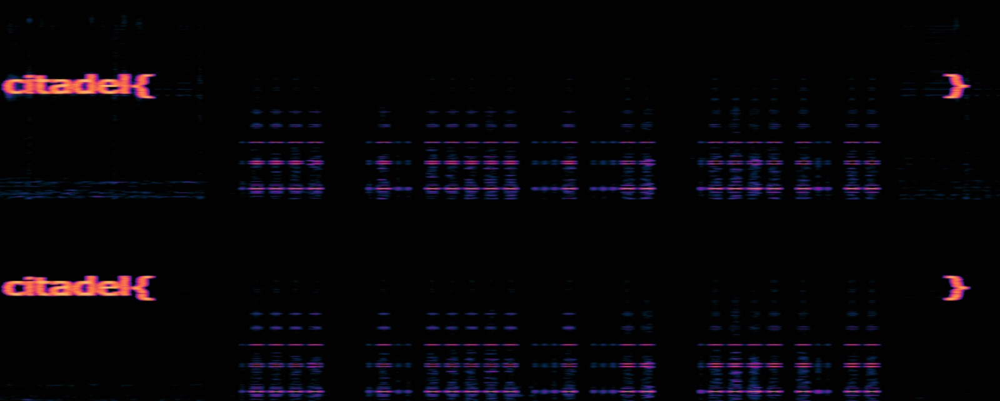

# Challenge 1 - track 8
Bypassing the second chamber leads to an empty floor except for a single artifact in the center: an old MP3 player, scratched and worn. On its surface, a cipher is etched, a message left behind for anyone who can decode it

```bash
twj eys zpr ukm 'viamnwqw' bx lzgo: esmqqui{yyr_oshwwcm_bwupa}
```
When you power it on, the sound fills the chamber. The tracks play like whispers from a lost world, and you recognize it as a song from Panchiko's latest studio album, particularly track no. 8. Its title feels familiar, hinting at a famous cipher. Decrypt it by using the album name as your key and continue your ascent.

## My solve
**Flag:** `citadel{add_vinegar_twice}`

The bottom half of the challenge description pointed to a song, specifically the track "Vinegar" by Panchiko on the album "Ginkgo". The challenge description also said that I should use the album name as the key but I still did not know what type of cipher the text was encrypted in. The challenge description hinted at the fact that the song title hints at a familiar cipher. After a quick google search, I found out that the key was encrypted in a cipher called "The Vigenère cipher". I then used a Vigenère cipher decoder to decrypt the key. The decrypted key read: "now use the key 'panchiko' on flag: rigckmv{osd_ikumqog_tjkjm}". I then followed these straightforward instructions to obtain the flag: "citadel{add_vinegar_twice}".

## What I learned
- Learned that different types of ciphers exist, specifically the Vigenère cipher.

## References
- [CitadelCTF](https://citadel.cryptonitemit.in/challenges)
- [Vigenère cipher decoder](https://www.dcode.fr/vigenere-cipher)


# Challenge 2 - Test of Sweetness
This floor feels like a digital world. The space is an illusion, all pink and sweet, stretching around you in impossible patterns. Here, you are no longer a climber but just another user.

Ahead, a door glows faintly. It is the only path forward and requires a level of authority you do not yet have. Fragments of session memory flicker, hinting at what it might take to gain higher access.

Challenge: https://testofsweetness.citadel.cryptonitemit.in

## My solve
**Flag:** `citadel{fru1tc4k3_4nd_c00k13s}`

The challenge description mentioned session memory which lead me to think that obtaining the flag would have something to do with the site's cookies. Therefore I opened the dev tools of the browser using F12. I, then, google where the site cookies are stored which lead me to the application panel. I then clicked on the cookies dropdown list and opened the entry named "https://testofsweetness.citadel.cryptonitemit.in". As the challenge said, "Here, you are no longer a climber but just another user". This lead me to believe that I had to elevate my access level to something above user. Therefore, I initially tried changing the "user" written under the "Name" columns to "admin" but that did not work. I, then, changed the text under the "Value" column to "admin" and reloaded the site. This lead to the flag being displayed.

## What I learned
- Learned how to manipulate the cookies of a website to obtain higher access levels

## References
- [CitadelCTF](https://citadel.cryptonitemit.in/challenges)


# Challenge 3 - Rotten Apple
Among the debris of this floor, you find a relic of sound: An album which turns out to be D>E>A>T>H>M>E>T>A>L by Panchiko, a long lost album. But the music is warped, as though it has undergone disc rot.

The path forward is hidden in the distortion. Similar to how the album was warped, the password to the next floor has been warped first by a factor of 47, then by a factor of 13. Untangle these changes to reveal the code and continue your ascent.

```bash
4:R256=Y3oRRoP0#~%Ro?A
```

## My solve
**Flag:** `citadel{b3tt3r_ROTt3n}`

I assumed that this was another cipher challenge like the first task. I then searched the challenge description for clues. I noticed that the word rot was used multiple times. Suddenly, it clicked that ROT was also a cipher (I remembered this from when I was searching for the Vigenère cipher). I then noticed that the description said that the 'password' has been warped first by a factor of 47 and then by a factor of 13. Hence, I used a ROT decoder to decode the cipher first using a factor of 13 (ROT13) and then by a factor of 47 (ROT47). This lead to me obtaining the flag.

## What I learned
- Learned how to manipulate the cookies of a website to obtain higher access levels

## References
- [CitadelCTF](https://citadel.cryptonitemit.in/challenges)
- [ROT Decoder](https://www.cachesleuth.com/rot.html)


# Challenge 4 - Randomly Accessed Memories
On your ascent to this floor, you hear these fragments being played back

```bash
clone it, pull it, reset it, stage it,
commit, push it, fork, rebase it,
merge it, branch it, tag it, log it,
add it, stash it, diff, untrack it.
```

You look around and discover a chamber containing a vast archive of Daft Punk’s music, intertwined with cryptic commits left behind by other musicians. They seem ordinary at first glance, but not everything in the history is what it seems.

Challenge: https://github.com/evilcryptonite/daft-punk-archive

## My solve
**Flag:** `citadel{w3_4r3_up_4ll_n1t3_t0_g1t_lucky}`

The challenge had a link to a github repository. The challenge description also hinted to going through the commit history of the repository using the statement: "intertwined with cryptic commits left behind by other musicians. They seem ordinary at first glance, but not everything in the history is what it seems.". Therefore, I started to go through the commit history of the repo and discovered a commit titled "Add secret chunk 3 (base64) [commit 279]". I clicked on it to investigate the commit. It contained what initially appeared to be gibberish. On further research, I realised that the contents were encoded in the base64 cipher. I came to this conclusion after search up base64 as hinted from the commit title. I then ran its contents through a base64 decoder to obtain the third chunk of the flag. Further digging lead to finding the second and first chunks. I decoded these and joined them together to obtain the flag.

## What I learned
- Learned about the base64 cipher

## References
- [CitadelCTF](https://citadel.cryptonitemit.in/challenges)
- [base64 Decoder](https://www.base64decode.org/)


# Challenge 5 - Selected Ambient Work
The symphonic adventure does not end here. On the next floor, a single song keeps echoing through the floor, repeating in a haunting loop. Amid the sound, you find a note left by a past candidate. It hints that the song holds a secret message, hidden in plain sight, much like how Aphex Twin concealed his face within his music with the help of spectrograms.

To move forward, you must find the message hidden in this sound.

Note: Separate the words in the flag with _ and make it UPPERCASE. Example: citadel{S3L3CT3D_AMB13NT_W0RK}

(The challenge also contained a .wav file to be downloaded named "selected_ambient_work")

## My solve
**Flag:** `citadel{1_L0V3_1DM}`

Firstly, I listened to the music file. I heard sequential long and short beeps which lead me to believe that the audio file contained morse code. Initially, I tried to decode the morse code manually by slowing down the audio file and writing down the dots and dashes but this did not work. I, then, reread the challenge description and noticed that it mentioned spectograms. Therefore, I put the audio file into a spectogram maker. The software I used is called audacity. This led to the following result:-



I then manually wrote down the dots and dashes between "citadel{....}" and put them through a morse decoder to obtain the flag. I then added the underscores between the words to get the flag in the format the flag submission box expected.

## What I learned
- Learned how to obtain the spectogram of an audio file

## References
- [CitadelCTF](https://citadel.cryptonitemit.in/challenges)


# Challenge 6 - Rotting In The Deep
The floor is quiet, almost unnervingly so – like the Citadel has paused to take your measure. A soft ring of presence settles around the chamber, the kind that marks a true landing: from here, it will ask for more and, in return, grant more. Etched into its surface is a sequence of numbers, worn and faint, as if time itself is eating them away. A whisper from the echoes guides you:

The message lies beneath the surface. Push it three steps forward in the cycle of life, and only then will the words emerge from the void.

(The challenge also had two files attached named: "out.txt" and "chal.py")

## My solve
**Flag:** `citadel{br0_r34lly_unr0tt3d_m3_b4ck_t0_l1f3}`

First of all, I tried to figure out what the "b" before "citadel{f4k3_fl4g_f4k3_fl4g}" meant while initializing the variable flag. After some research, I realised that it is a "bytes literal', i.e., it stores the raw bytes (the numbers represent each characters ASCII value in hex) into the flag. I also figured out by the functions name ("bytes_to_long()") that it converts the bytes data type to the long data type. Then, the str() function converts the long integer into a string.

In the second part of the program, I noticed that a for-loop loops through the digits of the string (which is an integer) stored in the flag variable. Inside the for-loop, the program repeatedly adds the value of out to digits[(int(i)+KEY)%10]. After some googling, I found out that digits is a string constant which contains all the digits from one to nine. As I was a little familiar with C, I related the fact that in C str[5] would print the character at the 6th index in the array str, likewise, I figured out that digit[integer] would print the character present in the digits string at that specific index.

Therefore, digits[(int(i)+KEY)%10] printed the character present that the index computed by "(int(i)+KEY)%10". Moving on, I figured out that this expression essentially adds 3 to int(i) and if it goes above 10 then the "%10" brings it back to between 0-9. Therefore, the inverse of that would be "(n-3)%10" where n is the encoded number and 3 is the key.

Therefore, I manually decoded each digit to obtain the flag.

## What I learned
- Learned how to analyse python commands
- Learned how to decode something when you know how it was encoded

## References
- [CitadelCTF](https://citadel.cryptonitemit.in/challenges)
- [GeeksForGeeks.com - Python string | digits](https://www.geeksforgeeks.org/python/python-string-digits/)


# Challenge 7 - Feels Like We Only Go Backwards
After finding the backdoor and making your way to the next floor, you step into a chamber awash with shifting colors and swirling echoes, a concert frozen in time. Kevin Parker stands at the center, his riffs bending reality around him. To ascend, you’ll need to join the session on his terms: push your voice further than comfort, align yourself with the number he hides in the haze, and piece together the melody concealed within layers of reverb. Only then will the music open the way upward.

(There was a file named "tameimpala" attached along with the challenge)

## My solve
**Flag:** `citadel{f0r_0n3_m0r3_h0ur_1_c4n_r4g3}`

Before everything else, I ran the command "file [filepath]" to get the nature of the file. It showed that the file was an ELF 64-bit executable file. When I opened the file in VS Code it showed a bunch of gibberish which lead me to believe that it was a binary executable file. I then ran the file in my linux terminal only for it to output some gibberish in coloured text but there was also some peculiar details in the output. I noticed that the file contained legible sentences inbetween the gibberish. I then ran the file through a binary decompiler and analysed the resultant psuedocode. I found two arrays named A[] and B[]. Array A[] stored single bytes as evident from its content. I then found a function which related the input to these two arrays:

```bash
B[i] == A[i] + 5*i + 2*input[i]
```

I then used algebra to invert the equation to obtain the value of the input:

```bash
input[i] = (B[i] - A[i] - 5*i) / 2
```

This allowed me to calculate the contents of the flag directly from the values stored in the arrays using a small python script:

```bash
A = [0x03,0x07,0x0b,0x0f,0x0b,0x07,0x03,0x07,0x0b,0x0f,0x0b,0x07,0x03,0x07,0x0b,0x0f,
     0x0b,0x07,0x03,0x07,0x0b,0x0f,0x0b,0x07,0x03,0x07,0x0b,0x0f,0x0b,0x07,0x03,0x07,
     0x0b,0x0f,0x0b,0x07,0x03]

B = [0x00c9,0x00de,0x00fd,0x00e0,0x00e7,0x00ea,0x00f9,0x0120,0x00ff,0x009c,0x0121,0x00fc,
     0x009f,0x0124,0x00b7,0x0118,0x0135,0x00bc,0x0141,0x00cc,0x002d,0x0148,0x00d9,0x0164,
     0x015f,0x0142,0x00ef,0x0154,0x015d,0x0100,0x0175,0x0160,0x018f,0x011c,0x0183,0x011c,
     0x01b1]

flag = ""

for i in range(37):
    val = B[i] - A[i] - 5*i
    ch = (val // 2) & 0xff
    flag = flag + chr(ch)

print(flag)
```

This program outputted the flag.

## What I learned
- Learned how to analyse binary executable files using tools like decompilers
- Learned how to analyze code
- Learned how to write code to decrypt encoded items

## References
- [CitadelCTF](https://citadel.cryptonitemit.in/challenges)
- [dogbolt - online binary decompiler](https://dogbolt.org/)
